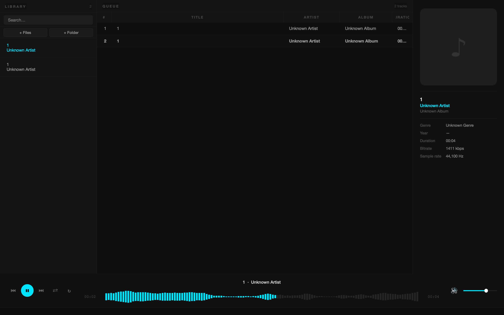

# MP3 Player

A desktop MP3 player built with Python and PyQt6. The application features a dark DAW-inspired theme, a persistent music library backed by SQLite, and a custom seek bar widget.

---

## Screenshot



---

## Features

- Play, pause, skip, and seek through MP3 files
- Persistent music library stored in a local SQLite database (`~/.mp3player/library.db`)
- Background folder scanning that reads track metadata (title, artist, album, duration) without blocking the UI
- Custom waveform-style seek bar
- Dark theme with cyan accents, styled entirely via a QSS stylesheet

---

## Tech Stack

| Technology | Purpose |
|---|---|
| Python 3.11+ | Language |
| PyQt6 | GUI framework and audio playback (QMediaPlayer) |
| mutagen | Reading MP3 metadata tags |
| SQLite (stdlib) | Persistent music library database |

---

## Project Structure

```
mp3_player/
├── main.py                  # Entry point — creates QApplication and opens MainWindow
├── requirements.txt
├── assets/
│   └── styles/
│       └── dark_theme.qss   # Application-wide dark stylesheet
├── models/
│   └── track.py             # Track dataclass (no Qt dependency)
├── core/
│   ├── player.py            # AudioPlayer wrapping QMediaPlayer
│   ├── database.py          # DatabaseManager (SQLite CRUD)
│   ├── metadata.py          # MetadataReader using mutagen
│   └── library_scanner.py   # QThread background folder scanner
├── ui/
│   ├── main_window.py       # Top-level window, wires all signals
│   └── components/
│       ├── player_controls.py
│       ├── track_info_panel.py
│       ├── playlist_view.py
│       ├── library_panel.py
│       └── waveform_bar.py  # Custom seek widget
└── utils/
    └── helpers.py           # Pure utility functions (e.g. ms_to_mmss)
```

---

## Installation

**Requirements:** Python 3.11 or newer.

```bash
# 1. Clone the repository
git clone https://github.com/JulianWIAI/mp3-player.git
cd mp3-player

# 2. Create and activate a virtual environment
python -m venv .venv
source .venv/bin/activate        # macOS / Linux
.venv\Scripts\activate           # Windows

# 3. Install dependencies
pip install -r requirements.txt
```

---

## Usage

```bash
python main.py
```

On first launch the application creates `~/.mp3player/library.db`. Use the **Add Folder** button inside the app to scan a directory and populate your library.

---

## Disclaimer

This project was created with the assistance of an AI (Claude by Anthropic). The code, architecture, and design decisions were developed collaboratively between the developer and the AI as a learning exercise for PyQt6 desktop development.